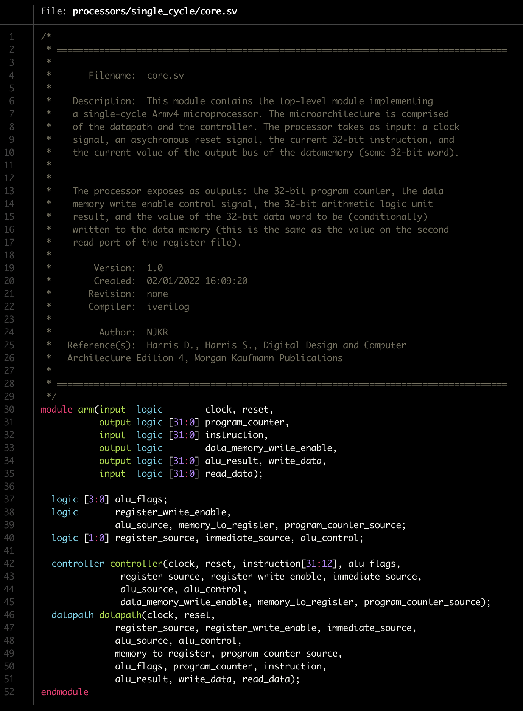
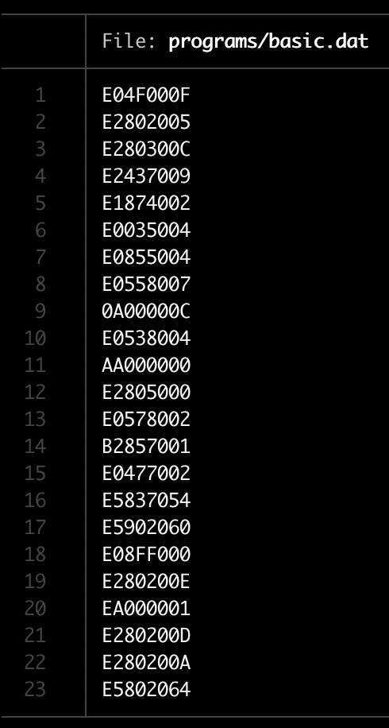
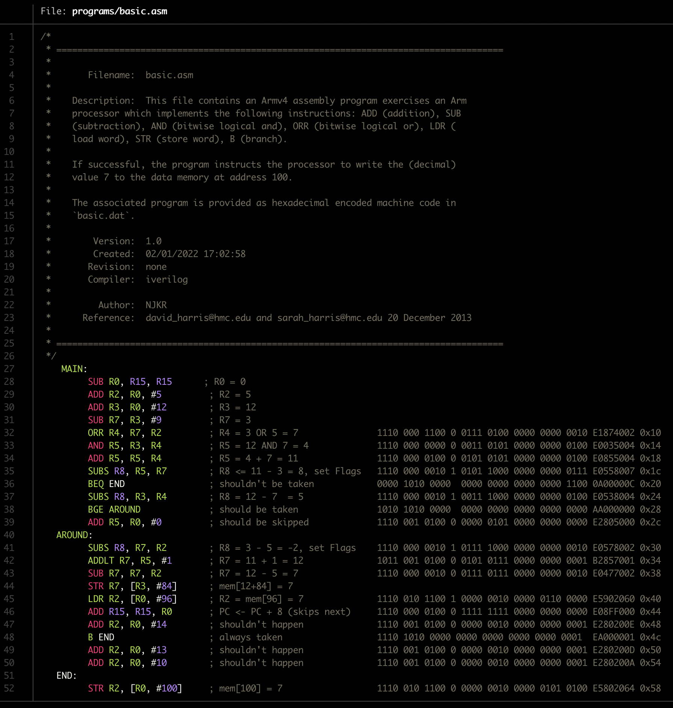

## Contents 
  1. [Background](https://github.com/njkrichardson/olya#background)
      1. [Why Arm?](https://github.com/njkrichardson/olya#why-arm?)
      2. [Untangling Terms: Architecture vs. Microarchitecture](https://github.com/njkrichardson/olya#untangling-terms-architecture-vs-microarchitecture)
      3. [Motivation](https://github.com/njkrichardson/olya#motivation)
  2. [Getting Started](https://github.com/njkrichardson/olya#getting-started)
  3. [How To Use This Guide](https://github.com/njkrichardson/olya#how-to-use-this-guide)
  4. [Extra Bits](https://github.com/njkrichardson/olya#extra-bits)
  6. [Acknowledgements](https://github.com/njkrichardson/olya#acknowledgements)
  7. [References](https://github.com/njkrichardson/olya#references)
---

## Background 

> We believe that building a microprocessor is a special rite of passage for
> engineering and computer science students. The inner workings of a processor seem almost magical to the uninitiated, yet prove to be straightforward
> when carefully explained. 
> 
> David Harris and Sarah Harris [1] 

The invention of the integrated circuit and subsequently the microprocessor has revolutionalized our world. Computing systems are the foundation of the internet. The recognition of the power of computing has transformed almost every field of science and engineering, and irreversibly altered the way we study biology, genomics, neuroscience, economics, mathematics, physics, chemistry, and aerospace engineering, to name a few. Computing systems have also radically changed the scale and nature of warfare, the reproduction rate of misinformation campaigns, and shaken the fabric of many of our social and cultural institutions. It is not hyperbole to say that a few lines of computer code could end the world as we know it (e.g., by detonating a cache of nuclear weapons). Microprocessors are therefore important socially, economically, and technically. Additionally, they are an inherently beautiful and inextricably intricate human invention. 

This document will guide you in the design and implementation of your own microprocessor. We'll start by examining digital logic gates which accept 0s and 1s as inputs and produce 0s and 1s as outputs. We'll then understand how to compose logic gates into more complex structures like arithmetic units and memories. Then we discuss the architecture of a computer; the programmer's model. Finally, we explore microarchitecture, the bridge from logic to architecture. 

Most importantly, along the way we'll learn the skills that separate computer engineers from a layperson: a set of systematic methods to manage complexity. A microprocessor may be the first system you build that is too complicated to fit in your head at once. We'll emphasize and reiterate the skills of abstraction, discipline, hierarchy, modularity, and regularity. These will enable you to reason about the placement of billions of transistors into a few square millimeters of silicon; and wire them up in such a way that they can execute your programs. With tools to manage complexity, you become the conductor of an orchestra of electrons which do your bidding: to execute a machine learning system, sequence a genome, wage war from thousands of miles away, launch a rocket to explore distant planets, or send an email to a friend. 

### Why Arm? 
I chose to implement [Arm](https://www.intel.com/content/dam/www/programmable/us/en/pdfs/literature/third-party/ddi0100e_arm_arm.pdf) [1] (rather than [x86\_64](https://en.wikipedia.org/wiki/X86-64), [SPARC](https://www.gaisler.com/doc/sparcv8.pdf), [MIPS](https://www.mips.com/products/architectures/), or [RISC-V](https://riscv.org/technical/specifications/), etc.) for two reasons. On one hand, Arm is a relatively clean and simple architecture, like MIPS or SPARC. On the other hand, Arm is a dominant commercial force, like Intel's x86\_64. 

Although Arm retains its RISC heritage in the modern versions (v8 and v9, at the time of this writing), the modern architecture standards are complex and much more idiosyncratic to meet demands for greater processor performance, security, and virtualization capabilities. With this in mind, we implement a processor which executes a subset of the Armv4 architecture, which is still the core foundation of the modern architectures. Importantly, architectures are more like dialects of the same language rather than distinct languages; once you know one, learning others is a relatively straightfoward project. 

An unfathomable number of bits of data are transformed, moved, and stored using Arm technologies. [Arm Ltd.](https://www.arm.com/) has shipped nearly 200 billion chips at the time of this writing, touching every corner of the computing landscape ranging 
from chips integrated into: network routers, mobile phones, embedded microcontrollers in cars and industrial equipment, aircraft, laptops, desktop computers, warehouse-scale computing 
servers, and supercomputers. Fujitsu's [Fugaku](https://www.fujitsu.com/global/about/innovation/fugaku/) supercomputer utilizes a custom Arm system on chip (SoC), for example. 

I feel confident that learning Arm is a practical investment in understanding the technology around you, and that once you start looking, you'll see chips all around you from your car to your headphones and everything in between. Statistically speaking, the vast majority of those chips implement the Arm architecture you'll learn in this guide, after all there are nearly twenty Arm chips per human on the planet. 

Generations into the future, twenty may seem a poor budget. Our descendents may have microprocessors embedded within the branches of their neural cell bodies. These cell bodies are nearly 10 microns across [4], with even current technology these cells could each  _geometrically_ contain a chip with thousands of transistors to help heal, augment, or virtualize our cognitive abilities. It's up to the neuroscientists and machine intelligence researchers to guide us in how to program them.


### Untangling Terms: Architecture vs. Microarchitecture

A computer **architecture** is the programmer's view of the machine. It is an abstract machine which provides a model of computation for the programmer. An architecture is comprised of an **instruction set** and **operand locations**. The instruction set 
is the set of operations the machine can execute, i.e., semantic descriptions of how the state of the processor is changed resultant from issuing the instruction a part of a program. Ultimately, every program must reduce to a finite sequence with elements drawn from this minimal set of instructions. 
The operand locations describe where the operands manipulated by the instructions can be found (e.g., registers and memories). 

Most often, many different implementations of an architecture exist. The specific topological arrangement of registers, memories, arithmetic units, and other 
building blocks is called its **microarchitecture**. Roughly you can think of the microarchitecture as the circuit specification of the processor. Downstream from microarchitecture design, myriad fields of study focus their attention on the task of mapping this topological description into a physical arrangement of atoms. Once the desired positions of the atoms are specified, billions of dollars and thousands of hours are dedicated to put them there. In essence, transforming sand to gold. 

Confusingly, the term **architecture** is often overloaded to refer to a span of several of the layers of abstraction in a computer system; roughly from compiler software to logic design. This reflects the fact that architects increasingly must leave the comfort zone to better understand the physical embodiment of their machines and the programs they execute. Therefore architects often have additional expertise in a lower layer like device physics or fabrication, or a higher layer like application software, compilers, and algorithms. In this guide I will use the terms architecture and microarchitecture according to their stricter definitions, except in the **Extra Bits** sections. 

### Motivation 
In this guide you'll learn to think like a microarchitect. Microarchitects must command the hardware to obey the programmer's abstract machine model. Programmers ceaselessly demand more 
memory and shorter execution times for their programs, which forces microarchitects to play increasingly extreme games "under the covers", ultimately providing a clean Von Neumann illusion 
to the programmer. Hardware engineers and scientists bend and break assumptions in the underlying physics to provide microarchitects with ever more 
performant physical building blocks to construct their processors and memories. 

#### Intended Audience
This guide is written for a curious programmer. Strictly speaking, she is (intellectually) shielded from the microarchitecture by the architecture. The set of programs one can run, and therefore dream up, or even **synthesize**, is identical. 
But, different points in the space of physical implementations incur real consequences. Programmers must begin to think in the context of threads and interconnect, the conventional 
Big O hammer obfuscates important realities. For instance: if matrix-matrix multiplication and matrix inversion both require a number of operations which scales cubically with respect to problem size, why can we execute neural networks so fast but Gaussian Processes so slowly? If matrix-vector multiplication requires a number of operations which scales quadratically with respect to problem size, why is matrix-matrix multiplication preferred from an energy efficiency perspective? Why does the energy required to multiply two numbers scale quadratically with the precision of their encoding? Why does just **moving** state between distinct locations in space now dominate the energy consumption of a computer, rather than the seemingly more complex task of transforming that state? 

 Gaining a deep understanding and an ability to make well-reasoned first principles inferences about the machines is invaluable(e.g., instruction/thread/data parallelism, memory systems, the physics of computing). 
My aim is to give you a view of what goes on beneath the covers of your machine, and a richer view of the interaction between algorithms and their
physical consequences in the traditional computing paradigm.

#### Looking Forward
We've come a long way. The first commercially produced microprocessor, the [Intel 4004](https://en.wikipedia.org/wiki/Intel_4004), was released in 1971. The circuit 
is comprised of around 2,000 transistors, a clock rate of 750kHz (period 1.33us), built on a 10um technology node. In 2020, the [Apple M1](https://en.wikipedia.org/wiki/Apple_M1) was 
released, an Arm-based system on chip (SoC) with 16 billion transistors, a 3.2GHz clock rate (period 312ps), built on a 5nm node. 

Despite this compounded growth, unmatched by any other field in engineering, performance on a single thread appears to be stalling in recent years [3]; primarily resultant of 
the culmination of Moore's law and Dennard scaling (linear constant field scaling). Advances in high numerical aperture optics, material science, and transistor physics will 
tighten the last bits of slack in the line; but no matter how clever, transistors cannot be smaller than atoms. Blood in the water and an inflated economic environment has drawn 
sharks from all sides offering the next great panacea for computing performance: quantum, analog, thermodynamic, photonic, and biological computing paradigms, to name a few. The future is 
ours to build. Much of the theoretical underpinnings of this work can be completed from the safety of the laboratory; but changing the world with these technologies, and shifting 
the culture of the computing industry to amass the resources and cooperation to implement those ideas will demand a profound and deep understanding of computers as we know them. 

## Getting Started 

We'll whet our appetites by executing a short program on the Arm core we'll be implementing. Later, we'll understand every detail of this test. We'll be able to read the assembly program, understand each bit of the associated machine code, and understand how bits of data move through the datapath of our processor to produce the expected results. 

For now, we'll get a first exposure to the Arm architecture by viewing its assembly language, and see how hardware is described in practice using hardware description languages (HDLs). Specifically, let's look first at the high-level implementation of our Arm core, written in one of the two dominant hardware description languages (HDL) used in professional computing design: SystemVerilog. 

First, clone this repository using either `https` or `ssh`, as follows: 

```bash 
$ git clone https://github.com/njkrichardson/olya  # https 
$ git clone git@github.com:njkrichardson/olya.git  # ssh 
```

Then, execute the dependency installer script by navigating to the `olya` directory and executing: 

```bash 
$ ./install_dependencies
```

The dependency installer assumes it is running on a MacOSX version later than OSX 10.11 (El Capitan) with the name `brew` resolved to a working HomeBrew installation (typically `brew` resolves to `/usr/local/bin/brew` which is a symbolic link to `/usr/local/Homebrew/bin/brew`). The core dependencies are an open-source SystemVerilog compiler called icarusVerilog for compiling our hardware description modules, and CPython3.8 for helper scripts. Unix `cat` and `hexdump` clones are also downloaded for more pleasant views of the code on the commandline. 

Let's first glance at the HDL code used to specify the processor we'll architect in this guide. Below I've included an image of the ouput of my terminal when I execute the following command from the `olya` directory: 

```bash 
$ bat processors/single_core/core.sv
```
<p align="center">
  
</p>

The entire top-level processor HDL code fits in some 22 lines of text, but we are employing abstraction here; the `controller` and `datapath` modules are complex pieces of hardware specified in different files, and these modules instantiate yet simpler modules specified in other files, and so on. 

The test program we'll use to exercise the processor is a sequence of instructions encoded as 32-bit binary numbers (since we build a 32-bit processor), and stored in a hexadecimal encoded text file with the instructions delimited by a newline. The machine language program is at `olya/programs/basic.dat`, and can be viewed using: 

```bash 
$ bat programs/basic.dat
```

<p align="center">
  
</p>

Humans don't read 1s and 0s (or hex, usually), so it's more convenient to view the program using **assembly language** instructions; a set of readable mnemonics for each instruction. In assembly language programs code blocks can be logically separated (analagous to how procedures/functions are separated in higher level languages) using indentation and a label succeeded by a colon `:`. 

```bash 
$ bat programs/basic.asm
```

<p align="center">
  
</p>

We don't need to understand any of the details of this program just yet. Notice from the comment on the last line of the program that the last instruction stores the decimal value 7 into the memory at address 100; this is the ad hoc condition we'll check to ensure our processor is running correctly. We can execute the testbench module via a simple provided Python script which (for now) handles all of module compilation and dependency structure. Later we'll execute the test by hand one we've gained some familiarity with hardware description languages and how they differ from software languages. We can see the inner workings of the test 
script by including the argument `--verbose`. 

```bash 
$ python3 tests/test_core.py --verbose 
```

```bash
─────────────────────────────────────────────────────────────────────────────────────────────────────────────────────────────────────────────────────────────────────────────────────────────────────────────────────────────────────────────────────────────
Module name          Path
-------------------  ----------------------------------------------------------------------------------------
core                 /Users/nickrichardson/Work/projects/armcore/processors/single_cycle/core.sv
datapath             /Users/nickrichardson/Work/projects/armcore/processors/single_cycle/datapath.sv
controller           /Users/nickrichardson/Work/projects/armcore/processors/single_cycle/controller.sv
decoder              /Users/nickrichardson/Work/projects/armcore/processors/single_cycle/decoder.sv
conditional_logic    /Users/nickrichardson/Work/projects/armcore/processors/single_cycle/conditional_logic.sv
alu                  /Users/nickrichardson/Work/projects/armcore/hardware_utils/alu.sv
combinational_logic  /Users/nickrichardson/Work/projects/armcore/hardware_utils/combinational_logic.sv
state                /Users/nickrichardson/Work/projects/armcore/hardware_utils/state.sv
testbench            /Users/nickrichardson/Work/projects/armcore/tests/testbench.sv
top                  /Users/nickrichardson/Work/projects/armcore/tests/top.sv

Compiling the processor and associated modules...

Running compiled test ouput...

Simulation succeeded

** VVP Stop(0) **
** Flushing output streams.
** Current simulation time is 205 ticks.
> 
```

We can see all of the modules used to compile our processor, and that the simulation succeeded! We can simply type `finish` at the carrot repl prompt that we are dumped into. Apparently, we have HDL which implements a processor which can execute programs, I hope this serves as motivation to understand every piece of how the processor works, from atoms to architecture. 

## How To Use This Guide 

There are two primary learning paths which both culminate in the implementation of your Arm processor. The **top-down** path begins at a high layer of abstraction: it begins with the module on architecture and programming, and concludes with the module on transistors and the physics of computation. Learner's following the top-down path get to dessert first in seing code and a complete processor, but can't yet understand many of the juicy details. It may feel intimidating or dissatisfying to have to skim over sections with terms and concepts introduced in the modules on hardware and microarchitecture. 

The **bottom-up** path builds a processor assuming no prerequisite knowledge except for a basic understanding of electricity. At the outset, building a microprocessor feels completely removed from the quantum physical effects which determine the operation of a transistor. But, ultimately, one gets to revisit basic architecture or programming concepts in the "later" modules with the surprising new knowledge of how to implement these primitives in hardware. 

Either way, both paths start at the same place. Whenever you're ready, go ahead and dive into the [introductory module](https://github.com/njkrichardson/olya/wiki/Computer-Engineering-Basics), which introduces background terminology and computer engineering basics that will be used throughout the guide. 

---

## Extra Bits 

The guide presented in this repository provides a simplified view of a microprocessor. Some explanations omit details in a way that could be misleading with respect to the real level of detail provided in advanced texts on computing architecture. For the curious, each page of the Wiki contains a section titled **Extra Bits** which discusses a few concepts in some greater depth. Each concept is typically a bonafide area of study in its own right, so these sections can only hope to give a teaser to the real content found in the associated references. The **Extra Bits** associated with the `README` introduces the concepts of: the CISC/RISC architecture properties, domain specific architectures, hardware-software co-design, Landauer's energetic limit for irreversible computation, the iron law of computing, Turing-completeness, and the concept of the ultimate RISC machine. 

---

#### RISC and CISC Architecture Properties
When Arm, MIPS, or (eponymously) RISC-V are referred to as reduced instruction set computer (RISC) architectures, this is in reference to the typical level of complexity of each instruction in the instruction set. Even without an understanding of hardware, intuitively a logical `AND` instruction requires significantly less hardware, energy, and time to execute compared to x86's `PUNPCKHDQ` instruction which unpacks and interleaves high-order quadwords. In this sense architectures comprised primarily of simple instructions are more "RISC-like" (e.g., Arm, MIPS, SPARC) while architectures laden with complex instructions are more "CISC-like" (e.g., x86, Vax, System/360). 

Operationally, it's useful to think RISC and CISC more like continous rather than binary valued properties of an architecture. Many people like to debate the merits of the RISC vs. CISC paradigm, but the argument is often oversimplified. In reality, things are complicated, and require consideration of the characteristics of the workload being targetted and fundamental physical tradeoffs between energy and entropy reduction. 

#### Hardware Specialization and Domain Specific Architectures
Hardware specialization and domain specific architectures (DSAs) are often overlooked in debates on RISC vs. CISC. Application-specific integrated circuits (ASICs) and DSAs are the epitome of CISC architectures. For example, the [Tensor Processing Unit](https://cloud.google.com/blog/products/ai-machine-learning/an-in-depth-look-at-googles-first-tensor-processing-unit-tpu) (TPU) architected by Google is a DSA with instructions like two-dimensional convolution and batched weight read. 

The _no free lunch theorem_ applies in hardware design, too, and is reflected in the modern trajectory of the industry (see, e.g., the most recent edition of Hennessy and Patterson [3]). That is, more and more attention is being 
directed to constructing machines which execute some programs exceptionally, in return for executing others poorly (the TPU won't be running gcc). Identifying the hypothesis space of programs of interest to your research or application thus translates to decisions in both software and hardware.

Because the workload (i.e., the set of programs) being targetted by a DSA is relatively narrow, the entropy (informally, the uncertainty) of the distribution over the program space is relatively smaller. Architects and compiler writers can exploit the regular structure of the programs in a way that allows for relatively more state change (progress on the computation) per unit time (e.g., via speculation or parallelism). Further, if architects dedicate significant attention to understanding the algorithm being executed, often larger, more complex, more abstract hardware modules can be developed to increase performance, and/or the algorithm can be rewritten to better exploit the hardware. 

For a concrete example, compare a graphics processing unit (GPU) and a general-purpose microprocessor (CPU). A GPU is a domain-specific architecture specialized for graphics (and increasingly, machine learning) workloads. A GPU consumes about 20pJ per instruction, whereas a CPU consumes about 2nJ per instruction; the CPU is roughly 100x less energy efficient per instruction. GPUs and CPUs differ in enumerable dimensions, but most importantly a GPU is designed to exploit the regularity observed in the empirical distribution of graphics and machine learning programs, and doesn't dedicate hardware or energy to techniques like branch prediction or speculative execution. Because of the gap between processor performance and memory performance, processors are forced to predict into the future; the advanced microarchitecture necessary to enable these methods costs time and energy. 

#### The Iron Law
Computer architects have a bad habit of declaring claims, assertions, observations, or intuitions to be "laws"; the iron law is an exception in that it is a simple but profound equality which describes any synchronous sequential state machine. This is an immense class of computer paradigms including most quantum and photonic computers. Additionally, it is simple to convince yourself that the iron law is practically a tautology; the concept does not invoke any nuanced hardware/physics assumptions. 

Programmers ultimately care about the execution time of their programs; therefore iron law is most often expressed with the execution time as one side of the equality. In that form, the law states: 

`execution times [s] = number of instructions * cycles/instruction * time/cycle [s]`

More formally, this law can be cast in terms of expected execution time with respect to the empirical distribution of the number of cycles per instruction (CPI).   Admittedly, each of the terms on the right hand side is the result of a nonlinear interaction of an immense number of variables. That said, the equation helps ground any project to improve the performance (at least, in terms of execution time) of executing some program: you can either reduce the number of instructions 
in the program, reduce the number of cycles required to execute any given instruction, or increase the clock rate on your machine (unfortunately, the clock rate is ultimately limited by the speed of light). 

It's also illustrative to start thinking about this law in terms of the concepts we've already discussed. CISC architectures tend to have fewer instructions than RISC architectures but require more cycles to execute each instruction in expectation. Empirically, the relative decrease/increase in the instruction count/CPI results in RISC architectures _generally_ being faster, at least on workloads which vary a lot in their characteristics. In contrast, on specific, low variance workloads, ASICs and DSAs decrease the number of instructions so much so that even though both the CPI and the clock period increase, higher performance is still achieved. The predictable character of the programs run by GPUs and other DSAs explains why they often cite signficantly lower clock rates (longer clock periods) than CPUs, much to the chagrin of the marketing teams. 

#### Landauer's Limit 
The discussion of RISC leads to a natural question: what is the "simplest" possible instruction or operation a computer can perform? One way of thinking about this is the concept of quantum phase space collapse, or informally, the irreversible/uninvertible nature of many data-manipulation instructions. Consider a two input `AND` operation/gate. Assuming the inputs are not stored/cached elsewhere, once the gate has transformed the inputs into an output (either a logical 0 or a logical 1), one cannot in expectation infer the inputs. 

One quarter of the time (assuming uniformly distributed i.i.d. inputs) the output will be a logical 1, in which case we can infer with certainty that both inputs were logical 1. But three-quarters of the time we will be unable to infer or "invert" the values of the inputs. This property of the `AND` operation is called irreversibility. Landauer's principle is a physical principle pertaining to a lower bound (a minimum possible value) for the energy consumed by any irreversble computation. It holds that if an observer loses information about a closed physical system (like a computing machine), the observer loses the ability to extract work from that system (equivalently, the information-lossy computation consumed energy). 

At room temperature (about 293K), the Landauer limit represents an energy of approximately 2.8zJ. For reference, a good modern hardware implementation can execute an 8-bit integer addition consuming about 30fJ; Landauer's limit beckons a 10,000,000x energy reduction. Interestingly, biological evolution has designed biological computing machines which execute (apparently) comparable operations in just 3aJ, but these systems still miss the mark by a factor of 1,000. Future computing machines may need to resort to accelerating objects lighter than electrons (or get more information per electron, as quantum hardware suggests) in order to approach Landauer's seductive limit. 

#### Turing-Completeness 
The statement "every program must reduce to a finite sequence with elements drawn from this **minimal set of instructions**" speaks to a sense of completeness of the instruction set. Even complex programs (operating systems, compilers, physical simulators, machine learning systems) written in modern feature-rich high-level languages (C++, JavaScript, CPython) are mapped to a massive sequence of `ADD`, `SUB`, `AND`, `ORR`, `LDR`, `STR`, and `B`. The concept of Turing-Completeness is a way to express the power of an instruction set; if an instruction set is Turing complete, it can run any program that a Turing machine can run, which is a very large set of programs.  

One way to both concretize one end of the RISC/CISC spectrum is by invoking the idea of the [ultimate RISC machine](https://en.wikipedia.org/wiki/One-instruction_set_computer), which takes the RISC concept to an extreme, defining just one instuction, and therefore obviating the need to define machine language operation codes. Ironically, this instruction is sometimes relatively complex, making the term somewhat an oximoron. 

---

## Acknowledgements
The implementation is inspired by and draws from the processor architected in the Arm edition of Harris & Harris' _Digital Design and Computer Architecture_ [2], specifically following the chapter on 
microarchitecture and the hardware description language (HDL) modules provided in the accompanying site [2]. 

I actually had the good fortune to take David Harris' computer architecture course as an undergraduate math major at Harvey Mudd College. Although I left the course with a measely B+ grade and a confused understanding of computers, what David Harris demonstrated to me in those Monday and Wednesday morning hours was a gift I can't possibly repay: a man with the insane drive to truly understand a computer, from atoms to architectures.  

## References 
  [1] [Arm Architecture Reference Manual](https://www.intel.com/content/dam/www/programmable/us/en/pdfs/literature/third-party/ddi0100e_arm_arm.pdf)
  
  [2] [Harris, David M., and Sarah Harris. Digital Design and Computer Architecture. 4th ed., Elsevier Science &amp; Technology, 2015.](https://www.elsevier.com/books/digital-design-and-computer-architecture-arm-edition/harris/978-0-12-800056-4)
  
  [3] [Hennessy, John L., and David A. Patterson. Computer architecture: a quantitative approach. Elsevier, 2011.](https://www.elsevier.com/books/computer-architecture/hennessy/978-0-12-811905-1)
  
  [4] [Fiala, John C., and Harris, Kristen M. Dendritic Structure. Oxford University Press, 1999.](https://synapseweb.clm.utexas.edu/dimensions-dendrites)
